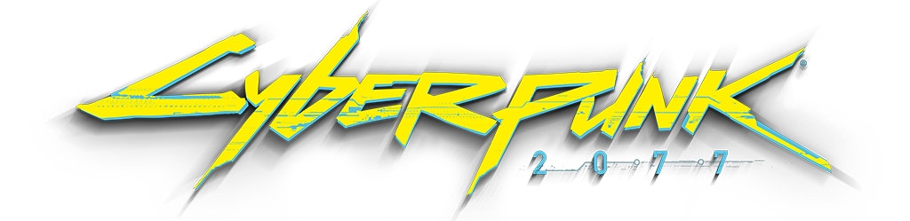

## Welcome

This is the home for the RED Modding Wiki!

Here you will find quick links to all of our public wikis from this central hub.

## RED4

[REDengine 4](https://wiki.redmodding.org/redengine4-research/)  
General documentation about REDengine 4

[WolvenKit](https://wiki.redmodding.org/wolvenkit/)  
The community Modkit developed for the REDengine 4 game Cyberpunk 2077. WolvenKit is a developer tool for modifying archive files and authoring complex mod projects.

[Cyber Engine Tweaks (CET)](https://wiki.redmodding.org/cyber-engine-tweaks/)  
Cyber Engine Tweaks is a framework that allows modders to interact with the game's internal functions using Lua. It also provides a user-interface with a console, tweakdb editor, and additional tools to assist developers.

[Redscript](https://wiki.redmodding.org/redscript/)  
Redscript is a community-built programming language and a set of tools designed to work natively with Cyberpunk 2077's scripting runtime.

[RED4ext](https://docs.red4ext.com/)  
RED4ext is a script extender for Cyberpunk 2077, allowing modders to interact or extend the scripting system.

[CP77 Tools (Deprecated)](https://wiki.redmodding.org/cp77tools/)  
The original command-line tool for modding Cyberpunk 2077 (deprecated by Wolvenkit)

## Red3

[REDengine 3](https://wiki.redmodding.org/redengine3-research/)  
General documentation about REDengine 3

[Legacy WolvenKit](https://wiki.redmodding.org/legacy-wolvenkit/)  
The original community Modkit developed for The Witcher 3